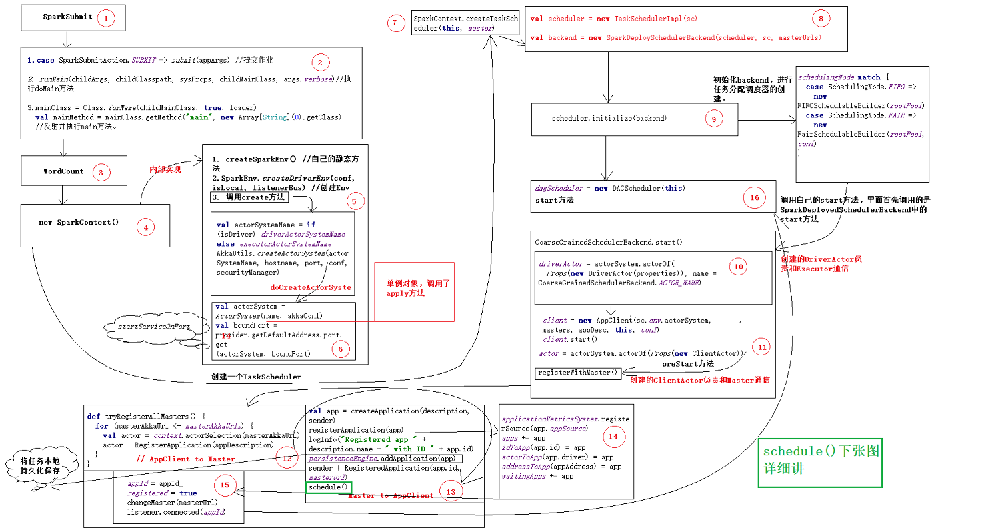
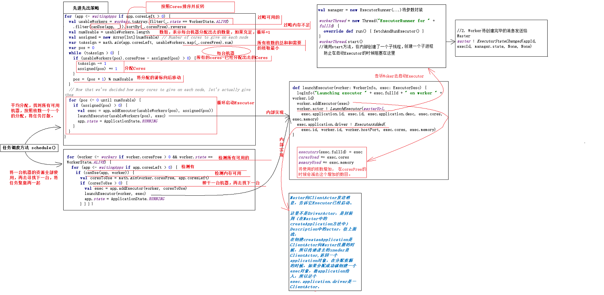
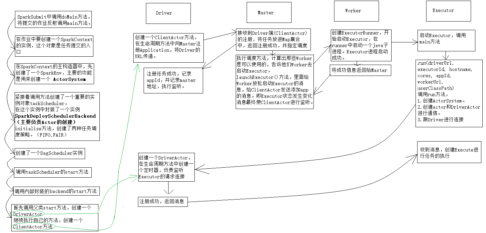
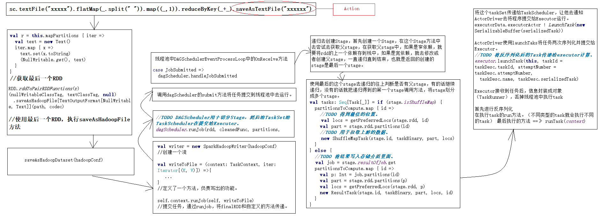

# Spark原理篇

前言：本片主要是理解Spark中的任务提交流程和Master与Woker启动过程，使用的源码是1.3，通信方式的Akka的RPC通信，便于理解，有助于以后理解发高版本的Spark源码。

2019/9/1

## 一、Akka实现rpc通信

<https://blog.csdn.net/erchouchou/article/details/98752052>

## 二、Spark启动流程

1. 使用strat-all脚本。

   ```shell
   # Start Master
   "${SPARK_HOME}/sbin"/start-master.sh $TACHYON_STR
   
   # Start Workers
   "${SPARK_HOME}/sbin"/start-slaves.sh $TACHYON_STR
   ```

2. start-master.sh脚本

   ```shell
   # 将配置属性初始化
   spark-daemon.sh start $CLASS 1 --ip $SPARK_MASTER_IP --port $SPARK_MASTER_PORT --webui-port $SPARK_MASTER_WEBUI_PORT $ORIGINAL_ARGS
   ```

3. Master类的启动

   ```scala
   1.val (actorSystem, _, _, _) = startSystemAndActor(args.host, args.port, args.webUiPort, conf) //actorSystem和actor
   
   2.val (actorSystem, boundPort) = AkkaUtils.createActorSystem(systemName, host, port, conf = conf,securityManager = securityMgr)//创建actorSystem，内部通过doCreateActorSystem方法。加载一些配置文件和信息。
   
   3.val actor = actorSystem.actorOf(Props(classOf[Master], host, boundPort, webUiPort, securityMgr, conf), actorName)  //通过actorOf方法创建actor，并执行主构造器方法，和preStart方法。
   
   4.context.system.scheduler.schedule(0 millis, WORKER_TIMEOUT millis, self, CheckForWorkerTimeOut) //设置定时器，检查Woker的过期
   
   5.actorSystem.awaitTermination()//阻塞，并执行子线程。
   
   
   ```
   
4. 定时器：

   ```scala
     def timeOutDeadWorkers() {
       // Copy the workers into an array so we don't modify the hashset while iterating through it
       val currentTime = System.currentTimeMillis()
       val toRemove = workers.filter(_.lastHeartbeat < currentTime - WORKER_TIMEOUT).toArray //过滤出超时时间的。
       for (worker <- toRemove) {//从worker列表中删除
         if (worker.state != WorkerState.DEAD) {
           logWarning("Removing %s because we got no heartbeat in %d seconds".format(
             worker.id, WORKER_TIMEOUT/1000))
           removeWorker(worker)
         } else {
           if (worker.lastHeartbeat < currentTime - ((REAPER_ITERATIONS + 1) * WORKER_TIMEOUT)) {
             workers -= worker // we've seen this DEAD worker in the UI, etc. for long enough; cull it
           }
         }
       }
     }
   ```

5. Woker启动流程

   ```scala
   1. val (actorSystem, _) = startSystemAndActor(args.host, args.port, args.webUiPort,args.cores,args.memory,args.masters,args.workDir)
   //1. main方法，创建actorsystem和actor。
   
   2.val (actorSystem,boundPort)=AkkaUtils.createActorSystem(systemName, host, port, conf = conf, securityManager = securityMgr) 
   //2. 创建actorsystem，内部执行doCreateActorSystem，配置信息和参数。
       
   3. actorSystem.actorOf(Props(classOf[Worker], host, boundPort, webUiPort, cores, memory, masterAkkaUrls, systemName, actorName,  workDir, conf, securityMgr), name = actorName)
   //3. 创建actor对象，执行preStart方法。
   
   4. registerWithMaster()
   //向Master注册流程。
   
   5.master ! RegisterWorker(workerId, host, port, cores, memory, webUi.boundPort, publicAddress)
   //5. 向Master发送信息，注册。
   
   6. if (state == RecoveryState.STANDBY) {
         // ignore, don't send response
      } else if (idToWorker.contains(id)) {
           sender ! RegisterWorkerFailed("Duplicate worker ID")
      } else {
   val worker = new WorkerInfo(id, workerHost, workerPort, cores, memory,sender, workerUiPort, publicAddress)
      if (registerWorker(worker)) {
       persistenceEngine.addWorker(worker)
       sender ! RegisteredWorker(masterUrl, masterWebUiUrl)
       schedule()
      }
   //6. Master中判断Woker是否能注册成功，并返回。
   7. registered = true 
      changeMaster(masterUrl, masterWebUiUrl)
      context.system.scheduler.schedule(0 millis, HEARTBEAT_MILLIS millis, self, SendHeartbeat)
   //7. 注册成功，定时发送心跳。
   8. actorSystem.awaitTermination()
   //8. 阻塞，并执行子线程。
   ```

   源码图如下图：
   
   

## 三、SparkSubmit流程

1. spark提交任务的过程

   ```shell
   bin/spark-submit --class cn.itcast.spark.WordCount  --master spark://node-1.itcast.cn:7077 --executor-memory 2g --total-executor-cores 4
   ```

   ```shell
   exec "$SPARK_HOME"/bin/spark-class org.apache.spark.deploy.SparkSubmit  -> exec "$RUNNER" -cp "$CLASSPATH" $JAVA_OPTS "$@"
   ```

   Class.forName通过反射调用自定义类的main方法（只有一个进程）

2. 启动SparkSubmit

   ```scala
   case SparkSubmitAction.SUBMIT => submit(appArgs)
   ```

3. 执行runMain方法

   ```scala
   runMain(childArgs, childClasspath, sysProps, childMainClass, args.verbose)
   ```

4. 反射调用main方法

   ```scala
   mainClass = Class.forName(childMainClass, true, loader)
   val mainMethod = mainClass.getMethod("main", new Array[String](0).getClass)
   mainMethod.invoke(null, childArgs.toArray)
   ```

5. 反射调用的main方法没有开启进程。

6. main方法中存在一个SparkContext，是Spark程序的入口。存在于SparkSubmit(Driver)进程中。

7. 跟Master建立连接，通过Akka，为了以后的RPC通信。

8. DAGScheduler - - - - 将DAG切分成TaskSet

## 四、SparkContext

1. new SparkContext() 执行主构造器，创建了一个SparkEnv（主要用于创建ActorSystem）。

   ```scala
   1. 创建SparkEnv
   private[spark] def createSparkEnv(
         conf: SparkConf,
         isLocal: Boolean,
         listenerBus: LiveListenerBus): SparkEnv = {
       SparkEnv.createDriverEnv(conf, isLocal, listenerBus)
     }
   
     private[spark] val env = createSparkEnv(conf, isLocal, listenerBus)
     SparkEnv.set(env)
   
   2.调用了create方法，创建actorSystem
         val actorSystemName = if (isDriver) driverActorSystemName else executorActorSystemName
         AkkaUtils.createActorSystem(actorSystemName, hostname, port, conf, securityManager)
   3.调用AkkaUtils的createActorSystem中的函数doCreateActorSystem方法；
   //启用进程，并返回actor的端口。
   doCreateActorSystem方法
   val actorSystem = ActorSystem(name, akkaConf)
   (actorSystem, boundPort)
   ```

2. 创建一个TaskScheduler。

   ```scala
   1. 创建一个Scheduler，创建一个SparkDeployedSchedulerBackend，并初始化
     val scheduler = new TaskSchedulerImpl(sc)
     val masterUrls = sparkUrl.split(",").map("spark://" + _)
     val backend = new SparkDeploySchedulerBackend(scheduler, sc, masterUrls)
     scheduler.initialize(backend)
   2. 进行initialize方法，创建调度队列（FIFO，FAIR）
     schedulingMode match {
       case SchedulingMode.FIFO =>
          new FIFOSchedulableBuilder(rootPool)
       case SchedulingMode.FAIR =>
          new FairSchedulableBuilder(rootPool, conf)
     }
   ```

3. 创建一个DAGScheduler。

4. 启动TaskScheduler，调用start方法。

   ```scala
   1. 执行start方法，里面首先执行了SparkDeploySchedulerBackend的start方法。
      scheduler.start()->backend.start()
   2. 执行父类的start方法，创建一个DriverAcotr，负责和Executor通信。
   CoarseGrainedSchedulerBackend.start(){
       driverActor = actorSystem.actorOf(Props(new DriverActor(properties)),     
       name = CoarseGrainedSchedulerBackend.ACTOR_NAME)
   3. 在DriverActor的生命方法里面创建了一个定时器，定时接收来此Executor的连接请求。
      context.system.scheduler.schedule(0.millis, reviveInterval.millis, self, ReviveOffers)
   4. 继续向下执行，创建一个ClientActor，负责和Driver的通信
      client = new AppClient(sc.env.actorSystem, masters, appDesc, this, conf)；
      client.start()
   5.在client的start方法中创建一个ClientActor，执行构造方法和生命周期方法。最后是向Master注册一个Application
       actor ! RegisterApplication(appDescription)
   6. Master同意，将信息封装进application中，（消息保存到本地）并返回注册成功
      val app = createApplication(description, sender)
      registerApplication(app)
      //TODO 利用持久化引擎保存到本地或者Zookeeper
      persistenceEngine.addApplication(app)
      //TODO Master向ClientActor方法注册成功的消息。
      sender ! RegisteredApplication(app.id, masterUrl)
      //TODO Master开始调度资源。（其实就是把任务启动到哪一些Worker上。）
   7.开始资源调度，寻找Worker，并将application封装好，传给exec，涉及到了任务分配策略（一个是将任务打散，一个是将任务集合。）
      schedule()
       
      launchExecutor(worker, exec)
       
   8. 将消息发送给Worker,让他们开始启动Executor
       将消息发送给ClientActor，告诉他们Executor启动成功。
      worker.addExecutor(exec)
      worker.actor ! LaunchExecutor(masterUrl,exec.application.id, exec.id,       exec.application.desc, exec.cores, exec.memory)
     exec.application.driver ! ExecutorAdded(exec.id, worker.id, worker.hostPort, exec.cores, exec.memory)
   ```

   SparkContext图：

   

   Schedule图：

   

初始化执行流程

```
1. 执行SparkSubmit的main方法，调用runMain方法。
2. 在runMain方法中反射提交的类，并执行main方法。
3. new SparkContext 使任务提交的入口。
4. 创建sparkenv类，主要负责ActorSystem的创建。
5. 通过方法创建TaskScheduler，并且封装一个DeployedSchedulerBackend，通过initialize方法创建了两种任务调度策略，公平调度和先进先出调度。实际上是new的TaskSchedulerImpl
6. 创建一个DAGScheduler。
7. 调用TaskScheduler的start方法，里面实际上使调用了DeployedSchedulerBackend的start方法，
8. 调用父类的start方法，在里面创建了一个DriverActor，负责和Executor的通信。并创建了一个定时器，用来检查是否有Executor连接。
9. 继续往下执行，创建了一个ClientActor，执行生命周期方法，将信息封装到ApplicationDescription中,向Master进行注册。
10. Master将任务放到map集合和set集合中。并进行本地持久化保存。并返回Client注册成功。Driver收到注册成功的消息将applicationId记录并。进行监听
11. 进行Schedule方法，Master计算过滤可以使用的Worker，有两种方法，一种是一台可用的一个核心，循环进行选择，将任务打散分配到多台符合的机器上，占用的内存是一样的，但是核数是累加的。第二种方法是将任务分配到一台机器，如果不够再分配到第二台机器上。
12. 循环给这些选取的Worker发送信息，让他们启动Executor。
13. 首先Worker根据信息启动Executor，这个Executor是一个子进程，不会阻塞。并且给Master发送已经创建完成的信息。
14. Master告诉Driver任务已经再执行，让Driver进行监听。
15. 内部创建了一个ExecutorRunner，并调用了Start方法，run方法最终会执行到CoarseGrainedExecutorBackend的main方法。（至此不再深入研究）
16. 执行main方法的时候调用了，自己的调用了run方法
17. 在run方法中创建了一个ActorSystem，创建了负责和Driver通信的Actor --> CoarseGrainedExecutorBackend，执行生命周期方法：
18. 与DriverActor建立连接，并向DriverActor进行注册。
19. DriverActor返回注册成功的消息，CoarseGrainedExecutorBackend创建创建一个Executor进行任务的执行。
```

前期任务执行之前的流程：



## 五、任务执行流程

```
1. 首先，Transformation是不进行运算的，直到遇到Action。
2. 在WordCount例子中，在语句走到saveAsFile执行任务。
3. 在saveAsTextFile中，创建一个ParitionRDD，并且记录了最后一个RDD。
4. 使用这个RDD调用了saveAsHadoopFile（准备了一些参数）--->saveAsHadoopDataSet。
5. 在saveAsHadoopDataset(hadoopConf)方法中创建了一个流，定义了一个方法（用来将数据写出的方法）
6. 提交任务，self.context.runJob(self, writeToFile)，传递最后一个RDD，和自定义的方法。
7. runjob中的DAGScheduler用于切分Stage。
8. RDD调用runjob之后，最后会使用DAGScheduler的runJob方法，这个DAGScheduler是在Context初始化主构造器中创建的，并且内部封装了一个队列和线程，如果没有任务就会进入阻塞状态。
9. 在runjob中调用submitJob，并返回一个回调器。 
10. 创建一个事件，将rdd和方法等属性封装成事件，并丢到线程池中。
11. 线程池中一旦有任务进入，就不再阻塞，执行onRecive方法，通过不同的case class进行不同的处理，这里是case JobSubmitted,所以就会执行handleJobSubmitted方法来切分stage
12. 调用newStage方法去创建一个stage，在里面通过getParentsStage方法获取上一个stage。
-- 最后获得的是最后一个stage。
13. 在getParentsStage在这个方法中维护了两个HashSet和一个Stack，首先是最后一个rdd入栈，然后进行计算，当栈不为空的时候，就弹栈并且对rdd的依赖()判断，如果是窄依赖，就将依赖的rdd入栈，如果是宽依赖就去获取他的父stage，如果这个stage没有，就创建一个新的stage，也就是12中的方法，递归的去划分stage。
14. 在12步获得的stage是递归完成的最后创建的一个stage，将这个stage提交并执行。
15. submitStage还是使用递归，不断的去判断该stage是否还存在父stage，存在继续递归，不存在就调用submitMissingTasks。
16. 在submitMissingTasks中，将stage按照分区划分成多个Task，有两种类型，一种是ShuffleTask，一种是ResultTask
17，将各种tasks交给taskScheduler，提交，执行submitTasks方法，方法里面给ActorDriver发送信息，让他提交tasks
18. 将Task一个一个的序列化，并发送给CoarseGrainedExecutorBackend,并又封装了一层序列化。
19. ExecutorBackend接收到Task，反序列化，使用executor进行执行task，将Task封装到TaskRunner对象中，丢到线程池中进行工作。
20. 再一次堆task进行反序列化，调用task的run方法，接着调用runTask方法。
21. runTask中就分为两种类型分别执行不同的流程。
```



